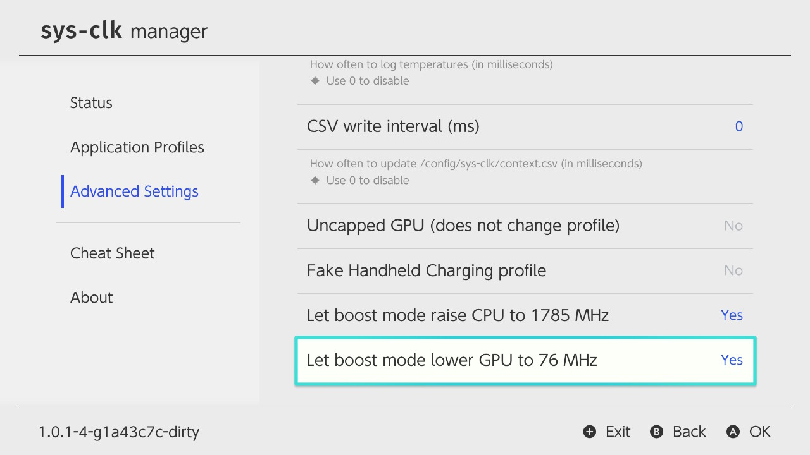
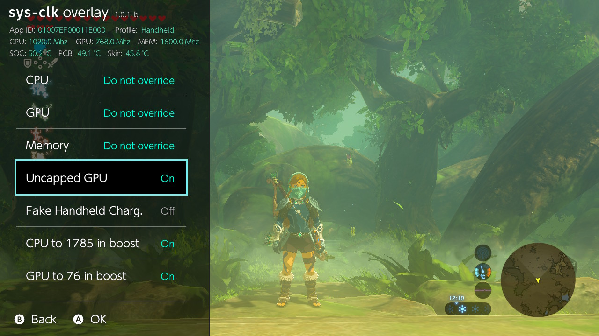
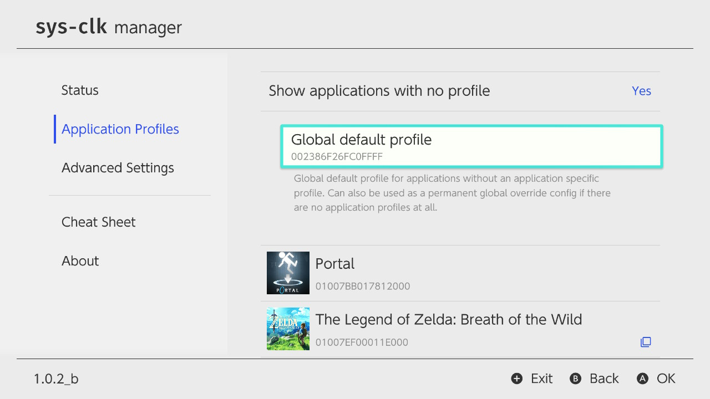

## 自定义配置

* 无限制GPU（不更改配置）
    1. 使用您想要的任何GPU频率值，无需连接充电器。
    2. 它不会改变配置，例如，没有充电器，您仍处于配置“手持模式”。如果您需要更改配置而不想连接充电器，请使用“最小配置”设置。
    3. 可能的值：`Yes` 或`No`。
    
* 最低配置（虚假配置）
    1. 选择的最低配置将确保您的设备至少保持在该最低级别。
    2. 它适用于在充电配置中具有较高时钟并且有时想要在没有充电器的情况下激活这些配置的人（例如，选择“官方充电器”将确保您的设备配置至少保持在“官方充电模式”，即使实际上您的设备是手持模式）。
    3. 如果实际配置高于最低配置，则选择的最低配置不会降级您的真实配置（例如，当插入底座时，选择“充电模式”不会做任何事情（因为您已经处于更高的配置））。
    4. 可能的值：
    `不超频`，
    `充电模式`,
    `USB充电模式`,
    `官方充电模式`或
    `底座模式`。
    
* 在加速期间将CPU设置为1785MHz
    1. 在加速模式期间，为CPU设置频率值，默认为1785MHz。
    2. 在大多数情况下，您希望启用此功能以获得最佳加载时间。如果您想在加速模式下也使用超过1785MHz的CPU时钟，请不要启用（您需要使用CPU补丁来实现这一点，而大多数人甚至没有）。
    3. 可能的值：`Yes` 或`No`。

* 在加速期间将GPU设置为76MHz
    1. 在加速模式期间，为GPU设置的频率值，默认为76MHz。
    2. 在大多数情况下，您希望启用此功能以充分利用电池寿命。
    2. 可能的值：`Yes` 或`No`。

* 超频内存频率至1600MHz
    1. 将内存永久超频为1600MHz（或通过修补实现的更高内存时钟）。
    2. 一种使用最大内存时钟的简单方法，无需执行特定应用配置文件或使用新的全局默认配置文件。
    2. 可能的值：`Yes` 或`No`。

* 全局默认配置文件
    1. 无特定配置的应用程序全局默认配置文件。
    2. 如果根本没有应用程序配置，也可以用作永久全局超频配置。
    2. 只能通过sys-clk manager来访问，始终是应用程序配置列表中的第一项，始终在列表中可见。

# sys-clk

SWITCH系统模块，可让您根据正在运行的应用程序和底座连接状态来设置CPU，GPU以及内存时钟。

## 安装

以下说明假定您具有运行Atmosphère或者sxos的Nintendo SWITCH，并且已至少更新为最新的稳定版本。
复制 `atmosphere` 或者 `sxos` ，以及 `switch` 文件夹到SD卡根目录下，并在出现提示时覆盖文件。 如果不进行更新，还请复制 `config` 文件夹，以使用默认设置。

**注意：** sys-clk-overlay需要具有 [Tesla](https://gbatemp.net/threads/tesla-the-nintendo-switch-overlay-menu.557362/) 安装并运行了。

## 相关文件

* 配置文件允许您为每个底座状态和Title ID设置自定义时钟，如下所述

	`/config/sys-clk/config.ini`

* 如果启用了写入日志文件，日志文件将存储在以下文件

	`/config/sys-clk/log.txt`

* 如果以下文件存在，将启用写入日志文件功能

	`/config/sys-clk/log.flag`

* 如果启用CSV上下文记录，Title ID、配置、时钟以及温度将存储在以下CSV文件

	`/config/sys-clk/context.csv`

* sys-clk管理器前端应用程序 (可从hbmenu访问)

	`/switch/sys-clk-manager.nro`

* sys-clk overlay (通过[Tesla menu](https://gbatemp.net/threads/tesla-the-nintendo-switch-overlay-menu.557362/)，可以从任何地方访问)

	`/switch/.overlays/sys-clk-overlay.ovl`
	
* sys-clk核心系统模块

	`/atmosphere/contents/00FF0000636C6BFF/exefs.nsp`
	`/atmosphere/contents/00FF0000636C6BFF/flags/boot2.flag`
	or
	`/sxos/titles/00FF0000636C6BFF/exefs.nsp`
	`/sxos/titles/00FF0000636C6BFF/flags/boot2.flag`

## 配置

可以通过将预设添加到位于 `/config/sys-clk/config.ini` 的ini配置文件中来自定义预设，为每个应用使用以下模板 

```
[Application Title ID]
docked_cpu=
docked_gpu=
docked_mem=
handheld_charging_cpu=
handheld_charging_gpu=
handheld_charging_mem=
handheld_charging_usb_cpu=
handheld_charging_usb_gpu=
handheld_charging_usb_mem=
handheld_charging_official_cpu=
handheld_charging_official_gpu=
handheld_charging_official_mem=
handheld_cpu=
handheld_gpu=
handheld_mem=
```

* 将 `Application Title ID` 替换为您要自定义的游戏或应用程序的Title ID。
可以在 [Switchbrew wiki](https://switchbrew.org/wiki/Title_list/Games)中找到游戏Title ID的列表。
* 频率以MHz表示，并将调整到最接近的可能值，如下面的时钟表所述。
* 如果省略任何键，则该值为空或设置为0，它将被忽略，并且将应用默认配置的时钟。
* 如果正处于充电状态，sys-clk将按该顺序查找频率，并选择找到的第一个 
	1. 充电器特定的配置 (USB或官方) `handheld_charging_usb_X` 或 `handheld_charging_official_X`
	2. 非特定的充电配置 `handheld_charging_X`
	3. 手持模式配置 `handheld_X`

### 示例1: Zelda BOTW

* 底座模式或者充电模式时，超频CPU
* 底座模式或者手持模式时，超频内存

使得整体帧率更平滑 (例如：在科鲁克森林)

```
[01007EF00011E000]
docked_cpu=1224
handheld_charging_cpu=1224
handheld_mem=1600
```

### 示例 2: Picross

* 手持设备上的欠频以节省电池

```
[0100BA0003EEA000]
handheld_cpu=816
handheld_gpu=153
handheld_mem=800
```

### 高级配置

`[values]` 部分允许您更改sys-clk中的时序，除非您知道自己在做什么，否则无需编辑其中的任何时序。 可能的值为：

| Key                     | Desc                                                    | Default |
|:-----------------------:|---------------------------------------------------------|:-------:|
|**temp_log_interval_ms** | 定义sys-clk日志温度的频率，以毫秒为单位 (`0` 为禁用)       | 0 ms    |
|**csv_write_interval_ms**| 定义sys-clk多久写入一次CSV，以毫秒为单位 (`0` 为禁用)      | 0 ms    |
|**poll_interval_ms**     | 定义sys-clk检查和应用配置文件的速度，以毫秒为单位           | 300 ms  |


## 限制

为了保护电池免受过度的消耗，根据您当前的配置文件，在应用之前，可能会限制config请求的时钟：

|       | 手持模式  | 充电模式 (USB) | 充电模式 (官方)       | 底座模式 |
|:-----:|:--------:|:--------------:|:-------------------:|:--------:|
|**MEM**| -        | -              | -                   | -        |
|**CPU**| -        | -              | -                   | -        |
|**GPU**| 768      | 921            | -                   | -        |

## 时钟频率表 (MHz)

### 内存时钟
* 1600 → 官方底座模式，升压模式，最大频率
* 1331 → 官方手持模式
* 1065
* 800
* 665

### CPU时钟
* 1785 → 最大频率，升压模式
* 1683
* 1581
* 1428
* 1326
* 1224 → sdev oc
* 1122
* 1020 → 官方底座模式和手持模式
* 918
* 816
* 714
* 612

### GPU时钟
* 921 → 最大频率
* 844
* 768 → 官方底座模式与手持模式最大频率
* 691
* 614
* 537
* 460 → 原始手持模式最大频率
* 384 → 官方手持模式
* 307 → 官方手持模式
* 230
* 153
* 76 → 升压模式

**注意：**
1. 手持模式下，GPU超频上限为768Mhz。充电模式下上限为921Mhz，无论您使用的是官方充电器还是第三方充电器。
2. 高于768MHz的时钟需要插入充电器（官方或者第三方）。
